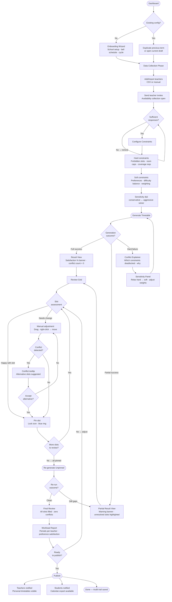
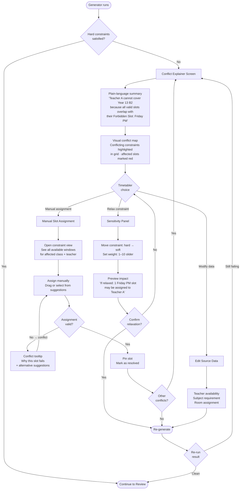
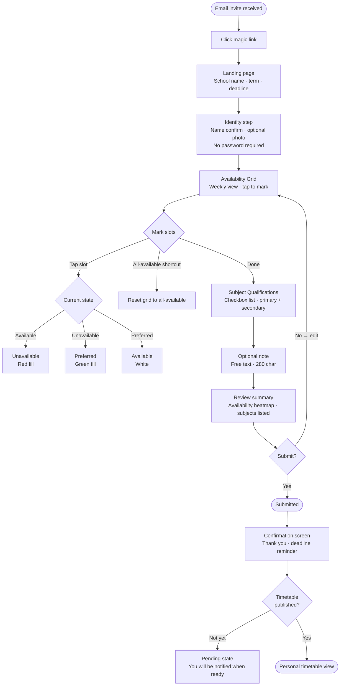

---
stepsCompleted:
  - step-01-init
  - step-02-discovery
  - step-03-core-experience
  - step-04-emotional-response
  - step-05-inspiration
  - step-06-design-system
  - step-07-defining-experience
  - step-08-visual-foundation
  - step-09-design-directions
  - step-10-user-journeys
  - step-11-component-strategy
  - step-12-ux-patterns
  - step-13-responsive-accessibility
  - step-14-complete
inputDocuments:
  - docs/requirements/mrd/SchediFlow_MRD_v1.0.md
  - _bmad-output/planning-artifacts/prd.md
---

# UX Design Specification SchediFlow

**Author:** Arthur
**Date:** 2026-03-27

---

## Executive Summary

### Project Vision

SchediFlow transforms school timetabling from a once-per-term manual ordeal into an
iterative, guided collaboration between the timetabler and a constraint-solving engine.
The product's core UX premise is that a generated schedule is a *draft*, not a verdict —
the timetabler pins what works, adjusts what doesn't, and re-runs the generator on the
remainder, repeatedly, until the result is one everyone can live with.

The platform serves five distinct personas — Timetabler, Teacher, Principal, Student,
and Parent — each with fundamentally different interaction needs, from the timetabler's
complex scheduling workspace to the student's simple personal view.

### Target Users

**Timetabler / Scheduling Coordinator** — Primary user. Often a teacher or deputy head
given scheduling responsibility without prior expertise. Uses SchediFlow intensively
during term planning windows (1–2 sessions per term). Needs guided onboarding,
generator confidence, and iterative control. Anxiety is high; the job carries real
institutional consequences.

**Teacher** — Submits availability preferences and views personal timetable. Primarily
mobile. Low session frequency; high stakes per session (getting their schedule right
matters to their daily working life).

**Principal / Admin** — Oversight role. Needs workload visibility, fairness reporting,
and a light-touch approval workflow. Primarily read-only. Values transparency and
auditability over control.

**Student** — Views personal timetable and expects calendar integration. Mobile-first.
Passive consumer of information with a low tolerance for friction.

**Parent** — Read-only access to child's schedule. Episodic use, likely via a shared link.

### Key Design Challenges

1. **Progressive Complexity**: The constraint system (hard rules, soft weights, sensitivity
dial) is powerful but intimidating. Timetablers range from first-timers to seasoned
schedulers. The UX must start simple and reveal depth without hiding power.

2. **The Dense Interactive Grid**: The scheduling workspace combines teachers, time slots,
rooms, and subjects in a single editable surface with pinning, drag-assignment, conflict
indicators, and partial regeneration. This must be navigable, editable, and fully
accessible (WCAG 2.1 AA, keyboard navigable).

3. **Conflict Communication as a Decision Point**: When generation fails or is partial,
the user must understand *why* and know *what to do* — not encounter an error state.
Plain-language conflict explanations with actionable options are trust-critical.

4. **Multi-Persona UX Divergence**: Five roles with fundamentally different needs share
one product. Each must feel purpose-built for their context without an over-engineered
shared interface.

### Design Opportunities

1. **The "Aha Moment"**: The first time a timetabler runs the generator and sees a
complete, satisfying draft schedule is the most important UX event in the product.
Designing this reveal — loading experience, result presentation, satisfaction score —
to feel exciting and trustworthy is the single highest-ROI UX investment.

2. **Transparency as Retention**: A beautiful, at-a-glance constraint satisfaction view
shows teachers and principals that their preferences were considered. This is a
word-of-mouth and renewal driver, not just a reporting feature.

3. **Guided Mastery**: Progressive disclosure that evolves with the user's confidence —
from wizard-guided first session to iterative grid expert. Reduces churn from early
overwhelm while preserving depth for power users.

## Core User Experience

### Defining Experience

The product's defining interaction is the iterative scheduling loop: run generator →
review draft with satisfaction score → pin good slots → adjust problem slots → re-run
on unpinned → publish. The single most critical action is the Generate → Draft Reveal
moment — the first time a timetabler clicks Generate and sees a complete schedule with
a constraint satisfaction score. This is the "aha moment" that determines trial → paid
conversion.

### Platform Strategy

SchediFlow is a web-first, responsive product with no native mobile apps in MVP scope.
It operates in two distinct UX modes sharing one product:

- **Power workspace (desktop)**: The timetabler scheduling workspace — dense grid,
  pinning, drag-and-drop, multi-panel constraint configuration, keyboard navigation
  required throughout (WCAG 2.1 AA).
- **Clean read experience (mobile)**: Teacher personal timetable, availability grid
  submission, student schedule view, parent read-only access. Designed for touch, low
  cognitive load, single-purpose per session.

### Effortless Interactions

These interactions must require zero conscious effort:

- **Teacher magic-link onboarding** — click link, fill availability grid, done in
  under 5 minutes, no account creation
- **CSV teacher import** — upload spreadsheet, teachers appear, no manual entry
- **Template selection** — pick institution type, Bell Schedule and Cycle pre-populate
- **Personal timetable viewing** — tap link, see week, export to calendar, done
- **Slot pinning** — one click, immediate visual feedback, no confirmation dialog

### Critical Success Moments

1. **The Draft Reveal** — Generator completes, satisfaction score appears, full grid is
   visible. Must feel fast, confident, and subtly celebratory. This is the conversion
   trigger.
2. **The First Clean Re-run** — After one manual adjustment, unpinned slots fill
   cleanly on re-run. The timetabler realises they control the process, not the engine.
3. **The Teacher's First Login** — Their preferences were honoured. Tuesday afternoons
   are free. This is the word-of-mouth moment.
4. **Conflict Explanation Clarity** — Generator fails; user reads the explanation and
   immediately knows the problem and their options. No dead ends.

### Experience Principles

1. **"Draft, Not Verdict"** — Every generated schedule is the start of a conversation.
   UI language, visual treatment, and available actions reinforce that the timetabler
   is in control.
2. **"The Tool Speaks Your Language"** — Configurable terminology is surfaced early and
   feels natural, not like an admin task buried in settings.
3. **"Show Your Work"** — Constraint satisfaction, preference weights, and conflict
   reasons are always visible. Transparency is the trust mechanism.
4. **"Right Tool for the Role"** — Each persona lands in an experience designed for
   their context: workspace for timetablers, profile for teachers, card for students.
5. **"Earn Complexity Gradually"** — Depth is revealed through use. First session is a
   wizard; subsequent sessions introduce iterative controls; experienced users work
   directly in the grid.

## Desired Emotional Response

### Primary Emotional Goals

1. **Competence / Mastery** (Timetabler) — The timetabler should feel genuinely
   capable — not just that the tool is easy, but that they are good at this now.
   The product must give them the experience of building something complex well.
2. **Calm Under Pressure** (All roles) — Timetabling is high-stakes and
   time-pressured. The UX must actively reduce anxiety, not add to it.
3. **Seen and Respected** (Teachers) — The preference system is only valuable if
   teachers believe it was genuinely considered. The UX must make this visible and felt.
4. **Trust in the Engine** (Timetabler, Principal) — Users must believe the
   generator is working for them. Transparency is the trust mechanism.

### Emotional Journey Mapping

**Timetabler arc:** Dread → Guided confidence → Anticipation → Delight (draft reveal)
→ Agency (iterating) → Pride (publishing) → Confidence (returning next term).

The core transformation: **from dread to competence**. Not just "this tool is easy"
but "I am genuinely good at this now."

**Teacher arc:** Mild skepticism (invite) → Surprised ease (magic link) → Seen and
respected (timetable reflects preferences) → Informed (change notifications).
Core goal: feeling respected by their institution, mediated through the tool.

### Micro-Emotions

- **Anticipation → Delight** at the draft reveal (not just relief — it should feel
  exciting)
- **Agency** during iterative refinement (the timetabler shapes the output, not the
  engine)
- **Pride** at publish — a moment worth marking visually
- **Surprise** at teacher onboarding ease ("that was all?")
- **Confidence** on return visits — the platform feels familiar and reliable

**Emotions to actively avoid:**
- Overwhelm — never dump constraint complexity in a first session
- Suspicion — "did it actually consider my preferences?"
- Helplessness — no dead ends when things go wrong
- Embarrassment — published timetables that teachers reject are career moments;
  make success the likely outcome

### Design Implications

| Target Emotion | UX Design Approach |
|---|---|
| Competence | Progressive disclosure; mastery moments; celebrate first publish |
| Calm | Generous whitespace; clear hierarchy; reassuring loading states |
| Trust | Always-visible satisfaction score; preference weights in report; named conflict explanations |
| Seen (teachers) | Personal view highlights honoured preferences; availability confirms submission |
| Agency | Immediate pin feedback; snappy manual adjustments; re-run always available |

### Emotional Design Principles

1. **Anxiety is the enemy** — Every UX decision should be evaluated against whether
   it reduces or increases the timetabler's anxiety. Default to the less stressful
   choice.
2. **Make success visible** — Pride and accomplishment require a moment of
   recognition. Publish, first generate, and preference satisfaction are all worth
   a visual beat.
3. **Earn trust through specificity** — Vague assurances ("your preferences were
   considered") erode trust. Named specifics ("James: Tuesday afternoons free ✓")
   build it.
4. **No dead ends** — Every error, conflict, and failed state must have a clear,
   calm next action. Helplessness is a churn signal.

## UX Pattern Analysis & Inspiration

### Inspiring Products Analysis

**PrimeTimeTable** — The primary scheduling tool reference. Dense, grid-first interface
where the entire screen is the timetable. Every cell shows data; no whitespace wasted.
Confirms the worker-tool philosophy: the grid IS the product.

**Linear / Plane** — Modern SaaS workflow tools. Clean three-column layouts, tight
information density, dark topbar with minimal chrome. The aesthetic reference for
SchediFlow's management and configuration surfaces.

**Excel / Google Sheets** — The mental model timetablers already have. Rows, columns,
cells, keyboard navigation, dense data. SchediFlow should feel like a purpose-built,
smarter version of the spreadsheet timetablers currently use.

### Transferable UX Patterns

**Full-school grid (rows=classes, columns=days×periods):**
Compact mini-slots per period cell. Subject color-coded by type (left border + subtle
background tint). Teacher code shown inline. Sticky class column and sticky header.
Year-group separators for visual chunking.

**Subject color system:**
Mathematics → blue · Sciences → green · Languages → purple · Humanities → amber ·
PE → cyan · Arts → pink. Color encodes subject type (scannable at a glance), not
teacher identity. Status overrides: conflict=red, cover=cyan tint, pinned=inset ring.

**View switcher in topbar:**
Class / Teacher / Room / Subject — same grid, different pivot. Switches without
leaving the workspace.

**Toggle teacher codes:**
Two-digit teacher codes shown inline in each slot. User-toggleable on/off. Supports
the experienced timetabler who works by code, and the newcomer who needs names.

**Collapsible legend panel:**
Teacher key and subject type legend collapsed by default to maximise grid space.
Revealed on demand. Never takes permanent screen real estate.

**Year-group filter buttons:**
Sub-toolbar filter to show all classes or isolate a year group. Reduces visual noise
when working on a specific cohort.

**Status bar (bottom):**
Persistent one-line summary: total slots, assigned, free, conflicts, last engine run.
Always visible without competing with the grid.

### Anti-Patterns to Avoid

- **Modal-heavy interactions** — never navigate away from the grid to perform a
  slot action. Context panels and inline actions only.
- **Colour as the sole differentiator** — text codes always accompany colour coding
  (WCAG 2.1 AA requirement, and practically necessary at small mini-slot size).
- **Decorative whitespace** — no hero sections, large margins, or illustrative
  empty states in the scheduling workspace. Every pixel serves data.
- **Legacy school admin aesthetics** — no table-heavy CRUD pages from 2010s school
  MIS interfaces. Clean, modern, functional.
- **Per-row action menus cluttering every row** — row actions appear on hover only.

### Design Inspiration Strategy

**Adopt:**
- PrimeTimeTable's density-first philosophy — the grid fills the screen
- Linear's dark topbar + view switcher pattern for workspace navigation
- Excel's sticky headers and keyboard-navigable cell model

**Adapt:**
- PrimeTimeTable's rainbow colour-per-teacher → SchediFlow uses subject-type colour
  (more meaningful, more accessible)
- Spreadsheet row-click → SchediFlow slot-click opens a context panel (not a new page)

**Avoid:**
- Any pattern that requires leaving the grid to complete a scheduling action
- Colour-only encoding for conflict/cover/pinned states
- Decorative UI elements that consume grid space

## Design System Foundation

### Design System Choice

**shadcn/ui + Tailwind CSS** on a React frontend.

shadcn/ui components are copy-pasted into the codebase rather than installed as a
dependency — the team owns them completely. Built on Radix UI primitives, which
provide WCAG 2.1 AA compliant keyboard navigation and ARIA behaviour for all
interactive components (dialogs, dropdowns, tooltips, selects, toggles) without
imposing a visual identity.

### Rationale for Selection

- **No visual fingerprint** — shadcn/ui has no intrinsic aesthetic; it looks exactly
  like the design system applied to it. MUI and Ant Design bleed through.
- **Ownership** — components live in the codebase. No upstream breaking changes,
  no version lock-in, no abstraction layer between the team and the component.
- **Accessibility included** — Radix UI primitives handle keyboard navigation,
  ARIA roles, focus management, and screen reader compatibility. WCAG 2.1 AA
  compliance for interactive components is the baseline, not an afterthought.
- **Tailwind alignment** — Tailwind utility classes map cleanly to the design
  token system (colours, spacing, radius, typography) defined in the mockups.
- **Worker-tool density is achievable** — unlike MUI or Ant Design, there is no
  default padding or component sizing to fight. Compact 34px rows and tight grids
  are straightforward.

### Component Responsibility Split

| Component type | Approach |
|---|---|
| Buttons, Inputs, Selects, Checkboxes | shadcn/ui, custom theme |
| Dialogs, Dropdowns, Tooltips, Popovers | shadcn/ui (Radix primitives) |
| Badges, Chips, Status tags | Custom, trivial |
| Data tables (management pages) | Custom React component, Tailwind styling |
| Timetable grid, mini-slots | Fully custom React component |
| Scheduling workspace, engine panel | Fully custom React components |
| Navigation, topbar, side panels | Custom layout components |

### Design Token System

CSS custom properties (and Tailwind config) define the full palette:

- **Navy** `#172436` — primary text, topbar, active states
- **Blue** `#4a78d3` — CTAs, links, active indicators
- **Border** `#d0d8e4` — all dividers and outlines
- **Background** `#f4f6f9` — page background, zebra rows
- **Subject colours** — Math/blue · Science/green · Languages/purple ·
  Humanities/amber · PE/cyan · Arts/pink
- **Status colours** — Conflict/red `#c0392b` · Cover/cyan `#2d8da1` ·
  Pinned/navy ring overlay

### Customization Strategy

All shadcn/ui components are modified at install time to use the SchediFlow token
system. The default slate/zinc palette is replaced with the navy/blue palette.
Component sizes are adjusted to the compact 34–38px height standard used throughout
the scheduling workspace. No component is used at its library defaults.

## Core User Experience

### 2.1 Defining Experience

"Run the engine, see your school's week appear, fix what's wrong, publish."

The timetabler clicks Generate, a complete schedule materialises across the full-school
grid in under 30 seconds with a satisfaction score, then they spend 10–30 minutes
pinning slots they like and adjusting ones they don't — running partial re-generates
until the result is ready to publish. This loop is the product.

### 2.2 User Mental Model

Timetablers come from spreadsheets. Their mental model: a grid of cells, each holding
a lesson; moving a lesson = cut and paste; a conflict = two things in the same cell.
SchediFlow honours this and extends it — the grid is still a grid, drag is still drag,
but the generator fills it for them and they correct the details.

The key shift: the timetabler is not fighting an engine that gives a take-it-or-leave-it
result. They are collaborating with a tool that does the heavy work and lets them tune
the outcome. The pin is the mechanism that makes this feel like collaboration.

### 2.3 Success Criteria

1. Draft appears complete and mostly right (≥85% soft preferences satisfied)
2. Conflicts are instantly visible and clicking one gives an actionable explanation
3. Pinning feels immediate — one click, no confirmation, visual feedback only
4. Re-run feels fast and safe — pinned slots visibly untouched, no surprises
5. Publish feels like a finish line — a moment of completion, not just a button

### 2.4 Novel UX Patterns

**Pin-and-partial-regenerate** — no familiar analogue. Metaphor: "locking cells in
Excel before running a formula." Surface this metaphor explicitly in onboarding and
tooltip copy to anchor the new pattern in something familiar.

**Constraint satisfaction score** — "89% of soft preferences satisfied" must read as
good news, not a failure report. Visual treatment and copy must frame it positively.

**Sensitivity dial** — downgrading a hard constraint to soft at runtime must feel
controlled and reversible, not like a scary system override.

### 2.5 Experience Mechanics

| Stage | User action | System response |
|---|---|---|
| Initiate | Click "Run engine" | Progress indicator showing real status ("Placing 340 lessons…") |
| Reveal | Engine completes | Grid populates; satisfaction banner appears with score and conflict count |
| Scan | Scroll the grid | Conflicts in red; free slots hatched; all lessons colour-coded by subject |
| Pin | Click a slot to keep | Inset ring appears; no dialog; immediate |
| Adjust | Click a conflict | Context panel: plain-language reason + 2–3 alternative slot suggestions |
| Re-run | Click "Re-run unpinned" | Engine runs on unpinned only; pinned slots visibly unchanged |
| Publish | Click "Publish" | Confirmation; teachers and students notified; timetable marked published |

## Visual Design Foundation

### Color System

**Core palette:**
Navy `#172436` · Blue `#4a78d3` · Border `#d0d8e4` · Background `#f4f6f9` ·
White `#ffffff` · Text `#172436` · Muted `#6b7a8e`

**Subject type colours (timetable encoding):**
Mathematics `#4a78d3` · Sciences `#2c9e78` · Languages `#7d63c7` ·
Humanities `#c47a20` · PE `#2d8da1` · Arts `#b8508a`

**Semantic status colours:**
Conflict `#c0392b` / `#fff1f1` bg · Cover `#2d8da1` / `#f0fbfd` bg ·
Pinned: navy inset ring · Free: diagonal stripe · Success `#2c9e78` · Warning `#d38a36`

All text/background pairings meet WCAG 2.1 AA (4.5:1 minimum). Navy on white = 13.5:1.

### Typography System

**Typeface:** Inter · system-ui fallback. Single typeface throughout.

**Scale:** 18px/700 page heading · 14px/700 section heading · 13px/400 body ·
12px/500 labels · 11px/400 meta · 10px/700 micro (mini-slot codes, uppercase tags)

**Rules:** No text below 10px. Uppercase + letter-spacing for metadata labels only.
Line height 1.4 body, 1.2 compact rows. Monospace for teacher codes only.

### Spacing & Layout Foundation

**Base unit:** 8px. Scale: 4 / 8 / 10 / 12 / 16 / 20 / 24px.

**Component heights:** Topbar 40px · Sub-toolbar 34px · Buttons/inputs 34px ·
Compact buttons 26px · Status bar 24px · Management table rows 38px.

**Layout:** Topbar (40px) → Sub-toolbar (34px) → flex workspace row
[side nav 160px | main content flex:1 | context panel 200px (on-demand)] →
Status bar (24px). All panels overflow: hidden + overflow-y: auto. No page scroll.

**Timetable grid:** border-collapse collapse · table-layout fixed · sticky first
column (z-index 2) · sticky header (z-index 3) · 2–3px cell padding ·
zebra rows (#fafbfd / #ffffff).

### Accessibility Considerations

- All status states have text/icon reinforcement — colour never sole differentiator
- Focus rings: 2px solid `#4a78d3`, offset 2px, on all interactive elements
- Keyboard: grid arrow-key navigation, logical tab order
- ARIA: role="grid" on timetable, aria-selected on slots, aria-live on engine status
- Minimum touch target: 34×34px
- Mini-slot title attributes provide full slot detail for screen readers
---

## 9. Design Direction Decision

### Selected Direction: Professional Light

**Decision date:** 2026-03-28
**Decision maker:** Arthur

**Direction description:** Fully light interface throughout — white topbar, white workspace, card-wrapped timetable grid with subtle shadow, dark sidebar (`#1a2740`). The grid feels clean and document-like, reducing eye strain during long scheduling sessions. Subject-color mini-slots retain full vibrancy against the white background. Slight border-radius (4px) and a box shadow on the grid card give it hierarchy without heaviness.

### Direction Characteristics

| Element | Specification |
|---|---|
| Topbar | White `#ffffff`, 1px border-bottom `#e5e7eb`, height 48px |
| Sidebar | Dark `#1a2740`, active item highlight `#4a78d3`, 160px wide |
| Workspace background | Light grey `#f3f4f6` |
| Grid card | White `#ffffff`, border-radius 4px, shadow `0 1px 4px rgba(0,0,0,.08)` |
| Grid header rows/cols | `#f8f9fb` fill, `#6b7280` text, `#e5e7eb` border |
| Grid cell (empty) | White `#ffffff` |
| Grid cell (zebra) | `#fafbfd` |
| Grid border | `#e5e7eb` 1px |
| Subject mini-slots | Unchanged from design system — full subject palette |
| Conflict state | `#fef2f2` cell fill, `#c0392b` top border 2px |
| Pinned state | 2px `#4a78d3` ring on mini-slot |
| Cover state | `#ecfeff` cell fill, dashed border |
| Status bar | White, `#e5e7eb` border-top, 36px height |
| Typography | Inter/system-ui, 13px base — unchanged |
| Focus rings | 2px solid `#4a78d3`, offset 2px — unchanged |

### Rejected Directions

**Direction 1: Command** — Dark topbar + white workspace. Rejected: user prefers
consistent light theme throughout; the dark topbar created unnecessary contrast
switching between topbar and content during dense work.

**Direction 3: Dark Pro** — Full dark mode. Rejected: timetablers work in lit offices,
often alongside paper schedules and projectors. A light interface matches the ambient
environment better and reduces context-switch fatigue.

### Impact on Concept Screens

The existing concept screens (`01-timetable-full-school.html`, `01-timetable.html`,
`02-teacher-management.html`) used Direction 1 (dark topbar). These will be updated
in future refinement passes to reflect the Professional Light direction. The grid
structure, component logic, and interaction model remain unchanged.

---

## 10. User Journey Flows

### Journey 1+2: The Iterative Timetabling Loop

**Who:** Timetabler (first-time or experienced)
**Goal:** Produce a published, valid timetable for the term
**Entry point:** Dashboard → "New Timetable" or "Open Draft"

This is the primary product journey. Every other feature exists to support it.



**Key UX moments:**
- **Anxiety → confidence transition**: Satisfaction % banner on first successful generation. Even 85% feels like progress.
- **Pin-and-partial**: The lock icon + blue ring must be instantly recognisable. Pinned = safe. Unpinned = solver territory.
- **Re-generate scope clarity**: Before re-running, show "X unpinned slots will be solved" count so the timetabler knows exactly what they're asking the engine to do.
- **Progress without overwhelm**: Wizard progress bar, but non-linear navigation allowed (can skip back).

---

### Journey 3: Constraint Conflict Resolution

**Who:** Timetabler (any experience level)
**Goal:** Resolve a hard-constraint deadlock and reach a valid schedule
**Entry point:** Generation failure screen

This journey is the hardest UX problem. The timetabler is already stressed; the worst outcome is an opaque error message with no actionable path forward.



**Key UX moments:**
- **Conflict explanation is a first-class screen**, not a modal or toast. It gets full panel space.
- **Plain language first**: "Teacher A cannot cover..." not "CONSTRAINT_VIOLATION: TEACHER_SLOT_OVERLAP".
- **Preview impact before relaxing**: Show what will change before the timetabler commits to relaxing a hard constraint.
- **Escape hatches always visible**: Relax / Assign manually / Edit data — three distinct recovery paths, always presented together.

---

### Journey 4: Teacher Onboarding

**Who:** Teacher (invited by timetabler)
**Goal:** Submit availability and qualifications in under 5 minutes
**Entry point:** Email invite → magic link

This must be the lowest-friction experience in the product. Most teachers will do this once per term on mobile.



**Key UX moments:**
- **Three-state toggle** (unavailable / preferred / available) on a single tap cycle — no dropdowns.
- **Deadline visible throughout**: Submission deadline anchors the page header.
- **Shortcut for simple cases**: "Mark all as available" one-tap for teachers with no restrictions.
- **Confirmation as receipt**: Submitted summary functions as a record — teachers feel confident their preferences were captured.

---

### Journey 5 (Principal): Oversight Pattern

Read-only access. Key pattern:

1. Receive link from timetabler → open Workload Report
2. Review period counts, preference satisfaction rate per teacher
3. Flag issues via comment → timetabler notified
4. Refresh view after timetabler adjustment → approve

**UX requirement:** Principal view uses the same grid component with `readOnly` prop. No editing controls rendered. Workload report is the primary entry point.

---

### Journey 6 (Student): Consumption Pattern

Passive, mobile-first. No scheduling controls. Key pattern:

1. Receive email → open personal timetable
2. View subject / teacher / room per slot
3. Export to calendar (iCal / Google)
4. Receive push notification on room/teacher changes

**UX requirement:** Student view is a filtered read-only projection of the published timetable showing only their class row. Room changes generate a diff notification automatically on publish.

---

### Journey Patterns

Standardised UX behaviours that appear across multiple journeys.

**Navigation patterns:**

| Pattern | Description |
|---|---|
| In-context editing | Edit data without leaving the timetable grid (drawer/panel, not new page) |
| Breadcrumb-free flow | Wizard steps show a progress indicator, not a breadcrumb trail |
| Persistent action bar | Primary action (Generate / Publish / Submit) always visible; not buried in menus |

**Decision patterns:**

| Pattern | Description |
|---|---|
| Preview before commit | Show impact of a change (constraint relaxation, slot move) before confirming |
| Conflict-then-alternatives | When an action fails, immediately offer the next viable option |
| Soft confirmation | Destructive actions require a single explicit confirm, never a double-dialog |

**Feedback patterns:**

| Pattern | Description |
|---|---|
| Progress as % | Generator output expressed as satisfaction percentage, not pass/fail |
| Inline conflict annotation | Conflicts shown as cell-level overlays, not a separate list |
| Status bar for engine state | Bottom bar shows engine state: Idle / Running / Done — never a blocking modal |
| Toast for async completions | Teacher notification sent, export ready → brief toast, auto-dismiss 4s |

---

### Flow Optimisation Principles

1. **Steps to value**: Timetabler can generate a draft in ≤ 10 actions from first login (wizard → import → generate)
2. **Recoverable by default**: Every destructive or irreversible action has a clear undo or re-run path
3. **Context preserved on error**: When generation fails, the grid state (pins, manual assignments) is not lost
4. **Mobile threshold**: Teacher onboarding (J4) and student view (J6) must complete their core task on a 375px-wide viewport

---

## 11. Component Strategy

### Design System Coverage

**Design system:** shadcn/ui + Radix UI + Tailwind CSS + React

**Available and directly usable from shadcn/ui:**

| shadcn Component | Used for |
|---|---|
| Button | All CTAs — Generate, Publish, Save, Pin |
| Input / Textarea / Label | Forms throughout |
| Select / Checkbox / Switch | Constraint config, subject qualifications |
| Sheet / Drawer | Context panel for slot editing, teacher drawer |
| Dialog / AlertDialog | Publish confirmation, destructive actions |
| Popover | Conflict tooltip, slot quick-info |
| ContextMenu | Right-click on timetable slots |
| Tooltip | Hover info on dense grid elements |
| Badge | Subject labels, status tags |
| Avatar | Teacher photos in workload report |
| Table | Teacher management list, workload report |
| Tabs | Year-group filter, timetabler/teacher view toggle |
| Progress | Generator satisfaction % bar |
| Skeleton | Loading states for grid and reports |
| Sonner (Toast) | Async completions — publish, export, notifications |
| Command | Global search / jump-to-teacher / jump-to-class |
| ScrollArea | Timetable grid container (sticky headers) |
| Alert | Non-blocking warnings (partial generation, deadline) |
| Sidebar | Left navigation (shadcn/ui sidebar primitive) |

**Coverage gap:** Nothing in shadcn/ui covers an interactive scheduling grid, a constraint sensitivity panel, a three-state availability grid, or an engine status bar. These require custom components.

### Custom Components

#### TimetableGrid

**Purpose:** The primary scheduling workspace. Rows = classes, columns = days × periods.

**Anatomy:**
- Sticky column header (period labels)
- Sticky row header (class names, year-group grouping)
- Cell matrix: each cell is a `SlotCell`
- Overlay layer: drag ghost, selection box
- Pin-count badge (bottom-right of header)

**States:** `view` | `edit` | `readOnly` | `loading`

**Key props:**
```ts
timetable: TimetableData
pinnedSlots: Set<SlotId>
conflicts: ConflictMap
onSlotPin: (slotId) => void
onSlotMove: (from, to) => void
readOnly?: boolean
yearGroupFilter?: string[]
```

**Keyboard:** Arrow keys navigate cells; Space pins/unpins; Enter opens slot edit sheet; Escape deselects.

**ARIA:** `role="grid"`, `aria-rowcount`, `aria-colcount`, `aria-selected` on active cell, `aria-label` on each cell includes class + day + period.

---

#### SlotCell

**Purpose:** One cell in the TimetableGrid. Contains 0–N MiniSlots. Carries conflict/cover/pinned state at cell level.

**States:** `empty` | `filled` | `conflict` | `cover` | `pinned` | `selected`

**Visual rules (Professional Light):**

| State | Background | Border |
|---|---|---|
| empty | `#ffffff` | `#e5e7eb` |
| filled | `#ffffff` | `#e5e7eb` |
| conflict | `#fef2f2` | `#c0392b` top 2px |
| cover | `#ecfeff` | dashed `#0891b2` |
| selected | `#eff6ff` | `#4a78d3` 1px |

**Interaction:** Click = select; Right-click = ContextMenu; Drag target = accepts drop.

---

#### MiniSlot

**Purpose:** Colored subject chip inside a SlotCell. Displays teacher, room, subject. The smallest meaningful unit of the timetable.

**Anatomy:** Subject color bar (left 3px) | subject abbreviation | teacher initials | room label | pin icon (if pinned)

**Sizes:** `sm` (full grid, 10px font) | `md` (detail panel, 12px)

**States:** `default` | `pinned` (blue ring 2px) | `conflict` (red ring) | `cover` (cyan dashed ring) | `ghost` (drag in progress)

**Accessibility:** `title` attribute with full slot detail for screen readers; subject color always paired with abbreviation text.

---

#### AvailabilityGrid

**Purpose:** Teacher availability submission. Weekly grid with three-state tap/click toggle per slot. Mobile-first, used in teacher onboarding.

**Three-state cycle:** available (white) → unavailable (red `#fef2f2`) → preferred (green `#f0fdf4`) → available

**Constraints:** Touch target minimum 44×44px; supports swipe-to-mark-row on mobile; keyboard: arrow keys + Space to toggle.

**Props:**
```ts
schedule: BellSchedule
value: AvailabilityMap
onChange: (map: AvailabilityMap) => void
readOnly?: boolean
```

---

#### GeneratorStatusBar

**Purpose:** Persistent bottom bar showing engine state. Never a blocking modal — timetabler can keep reviewing the grid while generator runs.

**Anatomy:** Engine state badge | satisfaction % | conflict count | "X unpinned slots" count | action button (Generate / Re-run unpinned / Cancel)

**States:**

| State | Appearance |
|---|---|
| idle | Grey badge "Idle" · last-run stats |
| running | Blue spinner + "Generating..." · animated progress |
| success | Green badge "Done" · satisfaction % prominent |
| partial | Amber badge "Partial" · unsolved count |
| failed | Red badge "Failed" · link to conflict explainer |

**Height:** 36px fixed to viewport bottom. z-index above grid, below modals.

---

#### ConflictExplainer

**Purpose:** Full-panel conflict diagnosis. First-class screen, not a tooltip. Shown when generator reports hard-constraint deadlock.

**Anatomy:**
- Plain-language summary (which teacher, which classes, why deadlocked)
- Affected slots highlighted in miniature grid preview
- Three action buttons: "Relax constraint" | "Assign manually" | "Edit source data"
- Expandable technical details — collapsed by default

**Props:**
```ts
conflicts: ConflictReport[]
onRelax: (constraintId) => void
onAssignManually: (slotId) => void
onEditData: (entityId) => void
```

---

#### SensitivityPanel

**Purpose:** Constraint configuration in a Sheet (right drawer). Allows moving constraints between hard/soft and adjusting weights.

**Anatomy:**
- Constraint list grouped by type
- Each row: label | hard/soft toggle | weight slider (1–10, soft only) | impact preview chip
- Changes staged locally → "Apply and re-run" commits

---

#### WorkloadCard

**Purpose:** Per-teacher workload summary used in the workload report (principal and timetabler views).

**Anatomy:** Avatar | teacher name | total periods badge | free periods badge | preference satisfaction % bar | flag button (principal only)

**Variants:** `compact` (table row, 40px) | `expanded` (card with day-by-day breakdown)

### Component Implementation Strategy

**Principle:** Build on shadcn/ui primitives; never re-implement what Radix UI already handles (focus management, keyboard navigation, ARIA). Custom components use Tailwind utility classes aligned with design tokens from the Visual Foundation section.

**Directory structure:**

```
src/
  components/
    ui/                   ← shadcn/ui generated (owned, not node_modules)
    timetable/
      TimetableGrid.tsx
      SlotCell.tsx
      MiniSlot.tsx
    scheduling/
      GeneratorStatusBar.tsx
      ConflictExplainer.tsx
      SensitivityPanel.tsx
    teacher/
      AvailabilityGrid.tsx
    reports/
      WorkloadCard.tsx
```

All custom components:
- Typed with TypeScript strict mode
- Export a `*.stories.tsx` for Storybook isolation testing
- Include a `readOnly` prop for principal/student view
- Use CSS custom properties for subject colors (themeable without JS)

### Implementation Roadmap

**Phase 1 — Core (MVP, J1–J3 supported):**
- TimetableGrid + SlotCell + MiniSlot
- GeneratorStatusBar
- ConflictExplainer
- SensitivityPanel (basic — hard/soft toggle only)

**Phase 2 — Teacher & Oversight (J4, J5):**
- AvailabilityGrid
- WorkloadCard + Workload Report page
- shadcn/ui Sheet for in-context teacher editing

**Phase 3 — Polish & Power Features:**
- SensitivityPanel full (weighted sliders, impact preview)
- Drag-and-drop in TimetableGrid (Phase 1 uses click-to-assign)
- Command palette (jump-to-teacher / jump-to-class)
- Calendar export integration

---

## 12. UX Consistency Patterns

### Button Hierarchy

Three levels, used consistently throughout:

| Level | Style | When to use |
|---|---|---|
| Primary | Solid blue `#4a78d3`, white text, 36px height | One per screen region — Generate, Publish, Submit, Save |
| Secondary | White bg, `#374151` border, grey text | Supporting actions — Duplicate, Export, Preview |
| Ghost | No border/bg, blue text on hover | Low-priority — Cancel, Reset, Undo |
| Destructive | Red `#c0392b` bg, white text | Delete, Unpublish — only after confirmation |

**Rules:**
- Never more than one Primary button in a panel/section
- Icon-only buttons always have `title` + `aria-label`
- Disabled state: 40% opacity, `cursor-not-allowed`, never hidden
- Loading state: spinner replaces label text; button width preserved

---

### Feedback Patterns

| Situation | Pattern | Duration |
|---|---|---|
| Generator completed | GeneratorStatusBar state change (green "Done") | Persistent until next run |
| Generator running | Status bar spinner + progress | Until complete |
| Async action success (publish, export) | Sonner toast bottom-right | 4s auto-dismiss |
| Async action failure | Sonner toast, destructive variant, "Retry" action | Manual dismiss |
| Hard constraint deadlock | ConflictExplainer full panel | Until dismissed/resolved |
| Soft warning (partial result, late deadline) | shadcn Alert inline, amber, dismissible | Until dismissed |
| Inline validation error | Red border + error text below field | Until corrected |
| Form field info | Tooltip on ? icon | Hover/focus |

**Rules:**
- No blocking alert dialogs for non-destructive notifications
- Toast only for actions that do not require follow-up; use inline or ConflictExplainer for errors requiring action
- Queue multiple toasts; never stack simultaneously

---

### Form Patterns

**Layout:**
- Single-column for data entry; two-column only for compact paired fields
- Labels above fields; helper text below in `#6b7280`, 12px
- No inline placeholders used as labels

**Validation:**
- Validate on blur, not on keystroke
- Show errors on submit for untouched required fields
- Required fields: asterisk in label + `aria-required="true"`
- Error messages specific: "Enter a period count between 1 and 12", not "Invalid input"

**Submission:**
- Primary submit bottom-right; Cancel/discard bottom-left (ghost)
- Dirty state: prompt "Unsaved changes — discard?" before navigating away
- Success: close sheet and show toast; do not navigate unless intent is clear

**Wizard forms:**
- Step indicator at top (dots or numbered, not breadcrumbs)
- Back never loses completed step data
- Can jump to any completed step; cannot skip ahead
- Final step shows review summary before submit

---

### Navigation Patterns

**Global layout:**
- Dark sidebar `#1a2740`, 160px — persistent desktop, icon strip at ≤768px
- Top bar white 48px — school name, avatar, notification bell, search trigger
- Breadcrumbs only in settings-style pages; not in timetable workspace

**Active state:** Left border `#4a78d3` 3px, bg `rgba(74,120,211,0.1)`, text white

**In-workspace navigation:**
- Year-group filter tabs above grid (not sidebar sub-items)
- View toggle (Full school / By teacher / By room) in toolbar above grid
- "Back to grid" always visible in any detail panel

**Deep links:** Every timetable state must be representable as a URL for sharing.

---

### Modal and Overlay Patterns

| Type | Use case | Width |
|---|---|---|
| AlertDialog | Destructive confirmation only (Delete, Unpublish) | 400px |
| Sheet (right) | Slot editing, teacher detail, constraint config | 360px |
| Sheet (bottom) | Mobile slot editing (≤768px) | Full width, 60vh |
| Popover | Conflict detail, slot quick-info, datepicker | ≤320px |
| ContextMenu | Right-click on slot — Pin, Move, Clear, View detail | Auto |
| Command | Global search, jump-to actions | 560px centred |

**Rules:**
- No stacked modals — a Sheet may contain a Popover, never another Sheet
- ESC dismisses topmost overlay; backdrop click dismisses Sheets but not AlertDialogs
- Focus trap active on all modals; focus returns to trigger on dismiss

---

### Empty States

| Context | Message | Action |
|---|---|---|
| No timetable yet | "No timetable for this term. Start by setting up your school." | "Set up school" |
| Grid with no teachers | "No teachers imported. Add teachers to get started." | "Import teachers" |
| Workload report (no publish) | "Publish a timetable to see workload data." | None |
| Search returns nothing | "No results for '[query]'" | Clear search |
| Teacher list empty | "No teachers yet. Import via CSV or add individually." | Two CTAs |

Centred icon + 18px heading + 14px body, max-width 320px. Never use a spinner for empty states.

---

### Loading States

| Component | Loading pattern |
|---|---|
| TimetableGrid initial load | Skeleton rows — 6 visible, animated shimmer |
| Generator running | Status bar spinner + "Generating…" |
| Teacher list | Table skeleton — 5 rows |
| Workload report | Card skeleton — 4 cards |
| Sheet (async data) | Skeleton inside sheet |

**Rules:**
- Skeleton width matches expected content width
- Never show spinner for < 300ms
- Operations > 3s: show progress % if available, otherwise indeterminate

---

### Search and Filtering Patterns

**Global search (Command palette):**
- Trigger: `⌘K` / `Ctrl+K` or topbar search
- Results grouped by type: teachers, classes, subjects, rooms
- Arrow keys navigate; Enter selects; ESC closes

**Grid filter (year-group tabs):**
- Tabs above grid: "All" + one per year group
- Filters rows immediately; state saved to URL

**Table search:**
- Inline text filter above table; debounce 200ms
- Column sort on header click; active sort shown by arrow icon
- Multi-filter dropdowns persist in URL params

**Filter clear:** "Clear filters" link appears only when filters are active; one click resets all.

---

## 13. Responsive Design & Accessibility

### Responsive Strategy

**Desktop (≥1024px) — Timetabler workspace (primary target)**

The full three-panel layout is only meaningful at desktop width:
- Dark sidebar 160px (fixed) + main content flex:1 + context panel 200–360px (on-demand)
- Timetable grid uses all available horizontal space; period columns fixed-width, class rows scroll vertically
- Minimum viable timetable workspace: 1024px. Optimal: 1280px+
- At 1280px+: context panel can be open simultaneously with the grid

**Tablet (768–1023px) — Reduced workspace, management views**

- Sidebar collapses to 48px icon strip with tooltip labels on hover
- Context panel renders as bottom sheet instead of right panel
- TimetableGrid: year-group filter becomes a compact dropdown; grid remains with reduced cell padding
- Teacher management, constraint config, workload report: fully usable at tablet width

**Mobile (<768px) — Teacher, Student, Parent**

The timetable scheduling workspace is not designed for mobile. Mobile-specific experiences:
- **Teacher onboarding**: Availability grid full-screen, 44px+ tap targets, bottom-sheet forms
- **Student/Parent timetable**: Single-column card list of the week's lessons; "Add to Calendar" CTA prominent
- **Teacher personal timetable**: Same card-list layout; day tabs for navigation
- Navigation: bottom tab bar replaces sidebar on mobile

---

### Breakpoint Strategy

Using Tailwind CSS default breakpoints (mobile-first):

| Breakpoint | Width | Layout |
|---|---|---|
| base (mobile) | 0–639px | Single-column, bottom nav, list views |
| sm | 640px | Spacing adjustments only |
| md | 768px | Sidebar collapses to icon strip; sheets become bottom sheets |
| lg | 1024px | Full sidebar restored; timetable grid enabled |
| xl | 1280px | Primary timetabler target; context panel co-exists with grid |
| 2xl | 1536px | More periods visible without horizontal scroll |

---

### Accessibility Strategy

**Compliance target: WCAG 2.1 Level AA**

**Colour contrast:**

| Context | Ratio required | Status |
|---|---|---|
| Small text (<18px) | 4.5:1 minimum | `#374151` on white: 10.4:1 — passes |
| Subject mini-slots | 4.5:1 | White abbreviation text on dark subject colour — verified |
| Status indicators | Never colour-only | All statuses include icon + text reinforcement |

**Focus management:**
- Focus ring: 2px solid `#4a78d3`, offset 2px
- Skip link: "Skip to main content" as first focusable element on each page
- Sheet/Dialog: focus moves to first focusable element on open; returns to trigger on close
- TimetableGrid: custom focus management via roving `tabindex` — arrow keys move within the grid

**Keyboard navigation:**
- All actions reachable by keyboard; no hover-only affordances
- TimetableGrid: arrow keys navigate cells, Space to pin/unpin, Enter opens edit sheet, Escape deselects
- ContextMenu: triggered by `Shift+F10` / application key as well as right-click
- Command palette: `⌘K` / `Ctrl+K`

**Screen reader support:**
- `role="grid"` on TimetableGrid with `aria-rowcount` + `aria-colcount`
- Each SlotCell: `aria-label="[Class] [Day] [Period] — [Subject, Teacher]"` or "Empty"
- `aria-selected` on active cell; `aria-live="polite"` on GeneratorStatusBar
- MiniSlot: `title` attribute with full detail; subject colour chip `aria-hidden="true"`
- Conflict state: `aria-describedby` pointing to conflict summary text
- Loading skeletons: `aria-busy="true"` on container

**Touch targets:** Minimum 44×44px on all touch-device interactive elements; AvailabilityGrid cells 48×48px preferred.

**Reduced motion:** All animations respect `prefers-reduced-motion: reduce`.

**High contrast mode:** Subject colours use CSS custom properties; `forced-colors` media query ensures borders remain visible.

---

### Testing Strategy

**Automated (CI pipeline):**
- `axe-core` via `jest-axe` — run on all component Storybook stories
- `eslint-plugin-jsx-a11y` — lint-time accessibility warnings
- Lighthouse CI — accessibility score ≥90 on key routes
- Chromatic — visual regression for responsive breakpoints

**Manual browser/device testing:**

| Browser | Desktop | Mobile |
|---|---|---|
| Chrome | Primary | Android |
| Safari | Yes | iOS (primary mobile) |
| Firefox | Yes | — |
| Edge | Yes | — |

**Screen reader testing:**
- VoiceOver + Safari on macOS — TimetableGrid navigation
- VoiceOver + Safari on iOS — teacher onboarding, student timetable
- NVDA + Chrome on Windows — TimetableGrid, ConflictExplainer

**Colour blindness:** All subject colours verified under deuteranopia, protanopia, tritanopia simulations.

---

### Implementation Guidelines

**Responsive development:**
```tsx
// Mobile-first layout pattern
<div className="flex flex-col md:flex-row lg:grid lg:grid-cols-[160px_1fr]">
  <Sidebar className="hidden lg:flex" />
  <main className="flex-1 min-w-0" />
</div>
```

- Use `min-w-0` on flex children containing the grid to prevent overflow
- Avoid fixed pixel widths except sidebar (160px) and context panel (360px)
- `overflow-x: auto` on grid scroll container — never on `body`

**Accessibility development:**
```tsx
// Roving tabindex on TimetableGrid
<div role="grid" aria-label="School timetable">
  <div role="row" aria-rowindex={rowIdx}>
    <div
      role="gridcell"
      tabIndex={isActive ? 0 : -1}
      aria-selected={isSelected}
      aria-label={`${className} ${day} Period ${period}`}
      onKeyDown={handleGridKeyDown}
    />
  </div>
</div>
```

- Semantic HTML first; ARIA only where native semantics are insufficient
- All form fields use `<label htmlFor>` — never placeholder as the only label
- Error messages linked via `aria-describedby`; success messages via `aria-live="polite"`
